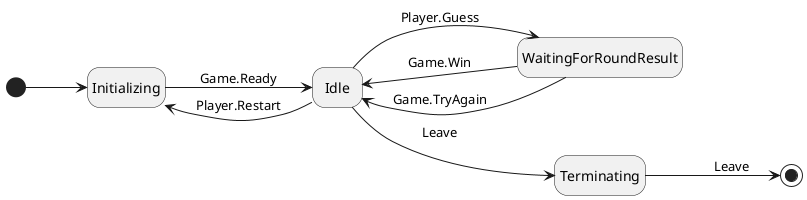

### Number Gussing Game

This game consists of two Actors:
- Game Actor
- Player Actor

The main program logic to start the game is straight forward, all we have to create is an ActorSystem and use this actor system to create a Game Actor.

```scala
package guess

import akka.actor.ActorSystem

object AppMain extends App {
  val system = ActorSystem("GuessingGame")
  val game = system.actorOf(Game.props())
}
```

The `Game` Actor later creates a `Player` Actor.

#### Game Actor
It is a simple Akka actor responsible for:
- Generating a random number between 1 to 100 (inclusive).
- Creating a player when the Game is created.
- Acting on the requests/messages sent by the Player (`Guess`, `Restart`, `Leave`)

```scala
package guess

import akka.actor.{Actor, FSM, Props}
import guess.Game.TryAgain

/**
 * Companion object to the Game class.
 */
object Game {
  case object Ready     // Message to send when the game is ready to be played.

  sealed trait Result
  case object  Win       extends Result // Messsage to send to a player when the guess is correct
  case object  TryAgain  extends Result // Message to send to a player actor when the guess is incorrect

  def props(): Props = Props(classOf[Game])
}

class Game extends Actor {
  var number = generate()

  // Initialize the player actor.
  val player = context.actorOf(Player.props(self))

  // The range of number is [1, 100].
  def generate(): Int = {
    val random = scala.util.Random
    random.nextInt(100) + 1 // .nextInt(N) provides random number from 0 to N-1.
  }

  override def preStart(): Unit = player ! Game.Ready

  override def receive: Receive = {
    // Player guesses a number and a simple logic below decides if the Player wins or lose.
    case Player.Guess(n: Int) => {
      if (n == number) {
        player ! Game.Win
      } else {
        player ! Game.TryAgain
      }
    }

    // Generate a new random number and signal Player actor that the new game is ready
    case Player.Restart =>
      number = generate()
      player ! Game.Ready
      
    // When a player decides to leave the game, we can end the game.  
    case Player.Leave => context.system.terminate()
  }
}
```

#### Player
A `Player` is an Akka Finite State Machine with some states (`Initializing`, `Idle`, `WaitingForRoundResult`, `Terminating`). 
Each state is responsible for specific set of tasks.



```scala
package guess

import akka.actor.{ActorRef, FSM, Props}
import guess.Game.Ready

import scala.concurrent.ExecutionContext.Implicits.global
import scala.concurrent.Future

object Player {
  sealed trait State
  case object Initializing extends State
  case object Idle extends State
  case object WaitingForRoundResult extends State
  case object Terminating extends State

  sealed trait Data
  case object EmptyData extends Data

  case class Guess(int: Int)
  case object Restart
  case object Leave

  def props(game: ActorRef): Props = Props(classOf[Player], game)
}

class Player(game: ActorRef) extends FSM[Player.State, Player.Data] {
  import Player._

  startWith(Initializing, EmptyData)

  when(Initializing) {
    case Event(Game.Ready, _) =>
      println("Pick a number between 1 and 100 (inclusive)")
      UserInputUtils.readNumericResponse.map {
        case Some(n) => self ! n
        case None => self ! Leave
      }
      goto(Idle)
  }

  // handle User Input in this FSM state.
  when(Idle) {
    case Event(number: Int, _) =>
      game ! Player.Guess(number)
      goto(WaitingForRoundResult)

    case Event(msg @ Leave, _) =>
      self forward msg
      goto(Terminating)

    case Event(restart: Boolean, _) =>
      restart match {
        case true =>
          game ! Player.Restart
          goto(Initializing)
        case false =>
          println("Goodbye!")
          game ! Player.Leave
          goto(Terminating)
      }
  }

  when(WaitingForRoundResult) {
    case Event(Game.Win, _) =>
      println("YOU WIN!!! \nPlay another round? (y/n)")
      UserInputUtils.readBooleanResponse.map(self ! _)
      goto(Idle)

    case Event(Game.TryAgain, _) =>
      println("WRONG GUESS. \nTry again? (y/n)")
      UserInputUtils.readBooleanResponse.map(self ! _)
      goto(Idle)
  }

  when(Terminating) {
    case Event(Leave, _) =>
      context.stop(self)
      stay()
  }

  whenUnhandled {
    case msg =>
      println(s"Unhandled message (${msg}) received.")
      stay()
  }
}
```

### Running the program
Run `sbt "runMain guess.AppMain"`
```bash
> sbt "runMain guess.AppMain"
[info] running guess.AppMain 
*******************
***SECRET NUMBER***
********33*********
*******************
Pick a number between 1 and 100 (inclusive)
45
WRONG GUESS. 
Try again? (y/n)
y
*******************
***SECRET NUMBER***
********50*********
*******************
Pick a number between 1 and 100 (inclusive)
50
YOU WIN!!! 
Play another round? (y/n)
y
*******************
***SECRET NUMBER***
********50*********
*******************
Pick a number between 1 and 100 (inclusive)
50
YOU WIN!!! 
Play another round? (y/n)
y
*******************
***SECRET NUMBER***
********46*********
*******************
Pick a number between 1 and 100 (inclusive)
46
YOU WIN!!! 
Play another round? (y/n)
y
*******************
***SECRET NUMBER***
********94*********
*******************
Pick a number between 1 and 100 (inclusive)
56
WRONG GUESS. 
Try again? (y/n)
y
*******************
***SECRET NUMBER***
********19*********
*******************
Pick a number between 1 and 100 (inclusive)
19
YOU WIN!!! 
Play another round? (y/n)
y
*******************
***SECRET NUMBER***
********12*********
*******************
Pick a number between 1 and 100 (inclusive)
11
WRONG GUESS. 
Try again? (y/n)
y
*******************
***SECRET NUMBER***
********59*********
*******************
Pick a number between 1 and 100 (inclusive)
59
YOU WIN!!! 
Play another round? (y/n)
y
*******************
***SECRET NUMBER***
********88*********
*******************
Pick a number between 1 and 100 (inclusive)
59
WRONG GUESS. 
Try again? (y/n)
y
*******************
***SECRET NUMBER***
********88*********
*******************
Pick a number between 1 and 100 (inclusive)
88
YOU WIN!!! 
Play another round? (y/n)
y
*******************
***SECRET NUMBER***
********59*********
*******************
Pick a number between 1 and 100 (inclusive)
59
YOU WIN!!! 
Play another round? (y/n)
n
Goodbye!
[success] Total time: 62 s (01:02), completed Apr 2, 2021 3:59:12 PM
```